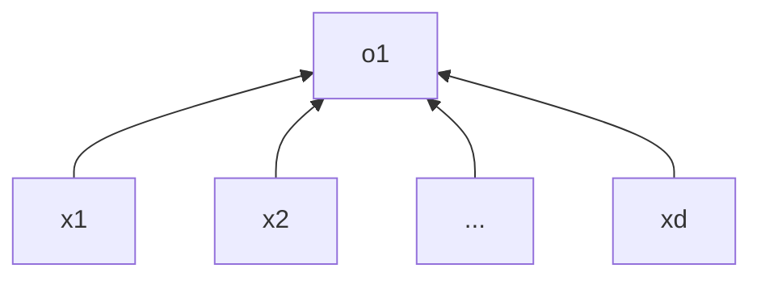

[本章视频地址](https://www.bilibili.com/video/BV1PX4y1g7KC?spm_id_from=333.999.0.0)，[本章讲义地址](https://zh-v2.d2l.ai/chapter_linear-networks/index.html)

> 在介绍深度神经网络之前，我们需要了解神经网络训练的基础知识。在本章中，我们将介绍神经网络的整个训练过程，包括：定义简单的神经网络架构、数据处理、指定损失函数和如何训练模型。经典统计学习技术中的线性回归和 softmax 回归可以视为*线性*神经网络。为了更容易学习，我们将从这些经典算法开始，向你介绍神经网络的基础知识。这些知识将为本书其他部分中更复杂的技术奠定基础。

<!--more-->

# 线性回归 (linear regression)

线性回归 (linear regression) 基于几个简单的假设：

**首先**，假设自变量 $x$ 和因变量 $y$ 之间的关系是线性的，即 $y$ 可以表示为 $x$ 中元素的加权和，这里通常允许包含观测值的一些噪声；**其次**，我们假设任何噪声都比较正常，如噪声遵循正态分布。


## 线性模型

线性假设指目标可以表示为特征的加权和：$y=w_1x_1+w_2x_2+w_3x_3 +...+ b$

$w_i$ 称为权重（weight），$b $称为*偏置*（bias），或称为*偏移量*（offset）、*截距*（intercept）。权重决定了每个特征对我们预测值的影响。偏置是指当所有特征都取值为 0 时，预测值应该为多少。

对于特征集合$X$，预测值 $\hat y \in R_n$ 可以通过**矩阵-向量**乘法表示为：$\hat y=Xw+b$

训练数据：$X=[x_1,x_2,...,x_n]^T,y=[y_1,y_2,...y_n]^T$

需要学习的参数：$W=[w_1,w_2,...,w_n]^T,b$

**线性模型可以看作是单层神经网络**



```python
def linreg(X, w, b): 
    """线性回归模型。"""
    return torch.matmul(X, w) + b
```


## 损失函数

**定义损失** -> 平方损失：$l(y,y')=\frac{1}{2}(y-\hat y)^2$

**损失函数**-> 在训练集的 n 个样本上的损失均值：$L(w,b)=\frac{1}{n}∑_{i=1}^{n}l^{(i)}(w,b)=\frac{1}{2n}∑_{i=1}^{n}(w^⊤x^{(i)}+b−y{(i)})^2$

**训练过程** -> 最小化损失来学习参数：$w^*,b^*=arg~min_{w,b} ~ l(\textbf{X,y,w},b)$


```python
def squared_loss(y_hat, y):  #@save
    """均方损失。"""
    return (y_hat - y.reshape(y_hat.shape)) ** 2 / 2
```


## 解析解（显示解）

解析解指可以通过数学公式简单地表达出来的解。

1. 将偏差加入权重，合并方法是在包含所有参数的矩阵中附加一列

2. 损失是凸函数，所以梯度值为 0 的地方就是最优解。
   我们的预测问题是最小化$\|\mathbf{y} - \mathbf{X}\mathbf{w}\|^2$。这在损失平面上只有一个临界点，这个临界点对应于整个区域的损失最小值。将损失关于 $\mathbf{w}$ 的导数设为0，得到解析解（闭合形式）：
   $$
   \mathbf{w}^* = (\mathbf X^\top \mathbf X)^{-1}\mathbf X^\top \mathbf{y}
   $$
   


> 像线性回归这样的简单问题存在解析解，但并不是所有的问题都存在解析解。解析解可以进行很好的数学分析，但解析解的限制很严格，导致它无法应用在深度学习里。


## 基础优化方法

当一个问题没有最优解时（NPC问题），应该使用什么方法来优化模型的预测结果（即学习参数）呢？

下面介绍几种基础的优化方法 :)

### 梯度下降

*梯度下降*（gradient descent）方法几乎可以优化所有深度学习模型。它通过不断地在**损失函数递减的方向**上**更新参数**来降低误差。

#### 优化过程

1. 挑选（如，随机初始化）待学习参数的初始值 $w_0$

   ```python
   w = torch.normal(0, 0.01, size=(2,1), requires_grad=True)#需要计算梯度
   b = torch.zeros(1, requires_grad=True)
   ```

2. 重复迭代参数 t=1,2,3…

   $w_t=w_{t-1}-\eta \frac{\partial l}{\partial  w_t-1}$

   - 沿着梯度方向将增加损失函数的值，负梯度方向即为损失函数值减小的方向。

   - 学习率 $\eta$（learning rate）：步长的超参数，人为选定，不能太大也不能太小。

     > 太大：结果震荡，不收敛；太小：计算梯度的成本太高。

   - $l$ ：损失函数

   

**小批量随机梯度下降**：

梯度下降最简单的用法是计算损失函数（数据集中所有样本的损失均值）关于模型参数的导数（在这里也可以称为梯度）。**但实际中的执行可能会非常慢**：因为在每一次更新参数之前，我们必须遍历整个数据集。因此，我们通常会在每次需要计算更新的时候**随机抽取一小批样本**，这种变体叫做*小批量随机梯度下降*（minibatch stochastic gradient descent）。

```python
# 随机选取小批量样本
def data_iter(batch_size, features, labels):
    num_examples = len(features)
    indices = list(range(num_examples))
    # 这些样本是随机读取的，没有特定的顺序
    random.shuffle(indices)
    for i in range(0, num_examples, batch_size):
        batch_indices = torch.tensor(
            indices[i: min(i + batch_size, num_examples)])
        yield features[batch_indices], labels[batch_indices]

batch_size = 10
for X, y in data_iter(batch_size, features, labels):
    print(X, '\n', y)
    break
```


```python
def sgd(params, lr, batch_size):  
    """小批量随机梯度下降。"""
    with torch.no_grad():
        # 参数更新时不需要计算梯度
        for param in params:
            param -= lr * param.grad / batch_size
            # 梯度手动设置为0，s.t.下一维参数梯度的计算与上一维度不相关
            param.grad.zero_()
```


**总结：**

- 梯度下降通过不断沿着反梯度方向更新参数求解
- 小批量随机梯度下降是深度学习默认的求解算法
- 两个重要的超参数是批量大小和学习率


## 线性回归的简洁实现


```python
import numpy as np
import torch
from torch.utils import data
from d2l import torch as d2l

"""生成数据集"""
true_w = torch.tensor([2, -3.4])
true_b = 4.2
features, labels = d2l.synthetic_data(true_w, true_b, 1000)

"""读取数据集"""
def load_array(data_arrays, batch_size, is_train=True):  #@save
    """构造一个PyTorch数据迭代器。"""
    dataset = data.TensorDataset(*data_arrays)
    return data.DataLoader(dataset, batch_size, shuffle=is_train)

batch_size = 10
data_iter = load_array((features, labels), batch_size)
# 为了验证是否正常工作，让我们读取并打印第一个小批量样本
next(iter(data_iter))

"""1. 定义模型"""

# `nn` 是神经网络的缩写
from torch import nn

# 指定输入和输出维度
net = nn.Sequential(nn.Linear(2, 1))

"""2. 初始化模型参数"""
net[0].weight.data.normal(0,0.01)
net[0].bias.data.fill_(0)

"""3. 定义损失函数：均方误差 MSE"""
loss = nn.MSELoss()

"""4. 定义优化算法：随机梯度下降 SGD"""
trainer = torch.optim.SGD(net.parameters(), lr=0.03)

"""5. 训练"""
num_epochs = 3 # 迭代三个周期
for epoch in range(num_epochs):
    for X, y in data_iter:
        l = loss(net(X) ,y)
        trainer.zero_grad() # 梯度清零
        l.backward()
        trainer.step() # 模型更新
    l = loss(net(features), labels)
    print(f'epoch {epoch + 1}, loss {l:f}')

"""打印误差"""
w = net[0].weight.data
print('w的估计误差：', true_w - w.reshape(true_w.shape))
b = net[0].bias.data
print('b的估计误差：', true_b - b)
```


### 小结

* 我们可以使用PyTorch的高级API更简洁地实现模型。
* 在PyTorch中，`data`模块提供了数据处理工具，`nn`模块定义了大量的神经网络层和常见损失函数。
* 我们可以通过`_`结尾的方法将参数替换，从而初始化参数。


## 问题记录

1. 损失函数为什么用平方损失而不是绝对插值？

   > 二者没有绝对区别，平方损失更便于求导。

2. 损失为什么要求平均？

   > 不是绝对要求平均，若不除以 n，梯度值会过大；
   >
   > 求平均的好处在于，计算出的样本梯度大小不会受到样本数量的影响，这样调整学习率时会更方便。

3. 随机梯度下降中的**随机**指什么？

   > 指随机采取一定量的样本。


